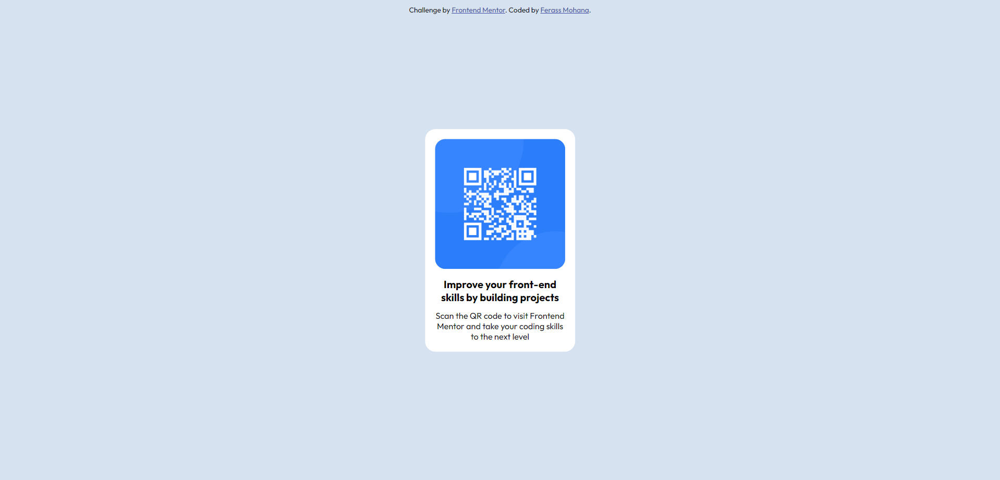

# Frontend Mentor - QR code component solution

This is a solution to the [QR code component challenge on Frontend Mentor](https://www.frontendmentor.io/challenges/qr-code-component-iux_sIO_H). Frontend Mentor challenges help you improve your coding skills by building realistic projects. 

## Table of contents

- [Overview](#overview)
  - [Screenshot](#screenshot)
  - [Links](#links)
- [My process](#my-process)
  - [Built with](#built-with)
- [Author](#author)

**Note: Delete this note and update the table of contents based on what sections you keep.**

## Overview

### Screenshot

A screenshots for the design in 1440px - 375px screen width.

### Links

- Solution URL: [Add solution URL here](https://github.com/ferassmohana/QR-code)
- Live Site URL: [Add live site URL here](https://ferassmohana.github.io/QR-code/)

## My process

### Built with

- HTML5 markup
- CSS custom properties
- Flexbox
- Mobile-first workflow

## Author

- Frontend Mentor - [@ferassmohana](https://www.frontendmentor.io/profile/ferassmohana)
- Facebook - [@Ferass Mohana](https://www.facebook.com/profile.php?id=100084166403321)

